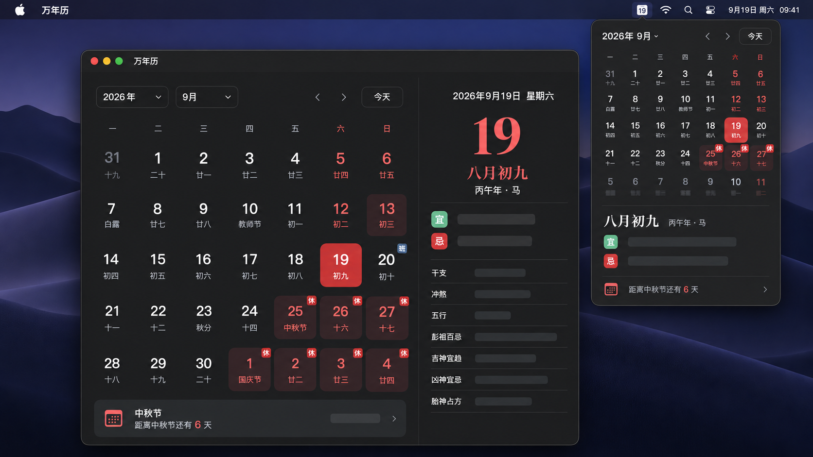

# 万年历 for macOS

一款原生 macOS 万年历应用，提供公历、农历、节气、传统黄历、中国大陆节假日、本地 Apple 日历事件和菜单栏快捷查看。



## 功能

- 月视图同时显示公历日期、农历日期、节气和传统节日。
- 显示中国大陆法定节假日、休息日和调休补班标记。
- 展示每日宜忌、干支、冲煞、五行、彭祖百忌、吉凶神等黄历信息。
- 读取 macOS“日历”App 已同步的本地、iCloud、CalDAV 和 Exchange 事件。
- 菜单栏面板快速查看月历、黄历、日程和节日倒计时。
- 鼠标左右拖动或触控板双指横向滑动切换月份。
- 支持浅色、深色以及跟随系统外观。
- 支持登录时启动。
- Dock 图标根据系统当天日期动态显示日号；安装包默认图标显示 12。
- 通过 Sparkle 从 GitHub Releases 手动或定时检查软件更新。

## 系统要求

- macOS 14.0 或更高版本。
- Xcode 26 或兼容版本（从源码构建）。
- XcodeGen 2.45 或更高版本（重新生成工程）。

## 安装

从 [GitHub Releases](https://github.com/RaulVan/Wannianli/releases) 下载最新版 ZIP，解压后将“万年历.app”拖入“应用程序”文件夹。

当前发布包**没有进行 Apple 公证**。首次打开时 macOS 可能提示无法验证开发者，可在 Finder 中右键应用并选择“打开”，或前往“系统设置 → 隐私与安全性”确认打开。发布包未经公证不代表已通过 Apple 的恶意软件在线检查，请仅从本仓库 Release 页面下载。

## 日历权限与隐私

应用使用 EventKit 读取 Apple 日历事件。首次启动时，系统会请求“日历”访问权限；关闭权限后，仍可正常使用农历、黄历和节假日功能。

- 日历事件仅在本机读取和展示。
- 应用不会新建、修改或删除 Apple 日历事件。
- 应用不会将日历事件上传到服务器。
- 联网仅用于更新节假日数据、检查软件更新和下载新版本。


## 软件更新

应用集成 [Sparkle 2](https://github.com/sparkle-project/Sparkle)：

- 选择应用菜单“检查更新…”可手动检查。
- 菜单栏面板的齿轮菜单也提供“检查软件更新…”。
- “设置 → 软件更新 → 检查间隔”可选择从不、每天或每周；选择“从不”时不会主动检查更新。
- 更新信息来自仓库根目录的 `appcast.xml`，安装包托管于 GitHub Releases。
- 更新压缩包使用 Sparkle EdDSA 签名校验完整性。

Sparkle 的 EdDSA 私钥只保存在发布者的 macOS 登录钥匙串中，不提交到 Git。`SUPublicEDKey` 公钥随 App 一同发布。

## 从源码构建

```bash
git clone https://github.com/RaulVan/Wannianli.git
cd Wannianli
xcodegen generate
./script/build_and_run.sh --verify
```

也可以直接打开 `Calendar.xcodeproj`，选择 `Calendar` Scheme 运行。

运行单元测试：

```bash
xcodebuild test \
  -project Calendar.xcodeproj \
  -scheme Calendar \
  -destination 'platform=macOS' \
  -only-testing:CalendarTests
```


## 发布新版本

1. 在 `project.yml` 中递增 `MARKETING_VERSION` 和 `CURRENT_PROJECT_VERSION`。
2. 确认 Sparkle EdDSA 私钥存在于发布 Mac 的登录钥匙串。
3. 执行：

```bash
./script/release.sh
```

脚本会构建 Release App、生成保持 framework 符号链接的 ZIP、使用 Sparkle 私钥签名，并更新根目录的 `appcast.xml`。随后提交版本和 Appcast，创建对应的 `v版本号` Git tag，并将 `release/Wannianli-版本号.zip` 上传到同名 GitHub Release。

本项目按当前要求不执行 Apple 公证。若未来转为正式公开分发，建议改用归属明确的 Developer ID Application 证书签名并完成公证。

## 项目结构

```text
Calendar/App          App 生命周期、窗口、菜单栏与菜单
Calendar/Design       设计 Token
Calendar/Models       日期、节假日和本地日程模型
Calendar/Services     历法、节假日、EventKit、Sparkle 更新与动态图标
Calendar/Views        主窗口、菜单面板、设置和日历组件
CalendarTests         单元测试
CalendarUITests       UI 测试
script                构建、图标、截图和 Release 脚本
project.yml           XcodeGen 工程定义（配置权威来源）
appcast.xml           Sparkle 更新 Feed
```


## 数据与依赖

- [LunarSwift](https://github.com/6tail/lunar-swift)：农历与黄历计算，MIT License。
- [holiday-calendar](https://github.com/cg-zhou/holiday-calendar)：中国大陆节假日数据。
- [Sparkle](https://github.com/sparkle-project/Sparkle)：macOS 软件更新框架，MIT License。
- Apple EventKit：读取用户授权的本地日历事件。

第三方许可说明随源码及 App 资源一同保留。

## 许可证

本项目采用 [MIT License](LICENSE) 开源。你可以在保留版权声明和许可声明的前提下使用、复制、修改、合并、发布及分发本项目。

## 开发说明

- `project.yml` 是工程设置的权威来源；修改依赖或构建设置后运行 `xcodegen generate`。
- 产品中文名固定为“万年历”，Swift 模块名为 `Wannianli`。
- Bundle ID：`local.Calendar.Wannianli`。
- 当前版本：1.0.2（Build 3）。
- 当前发布策略：公开 GitHub Release、Sparkle EdDSA 校验、不做 Apple 公证。

